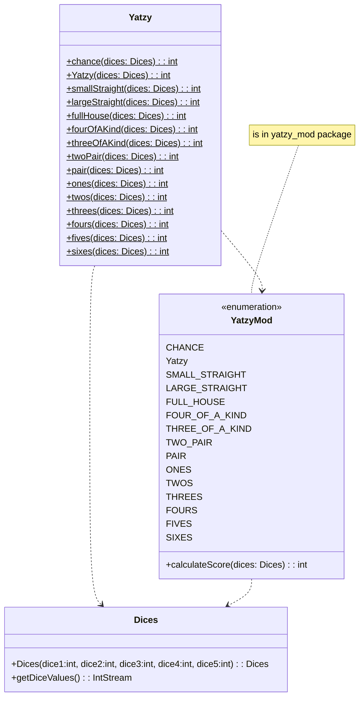
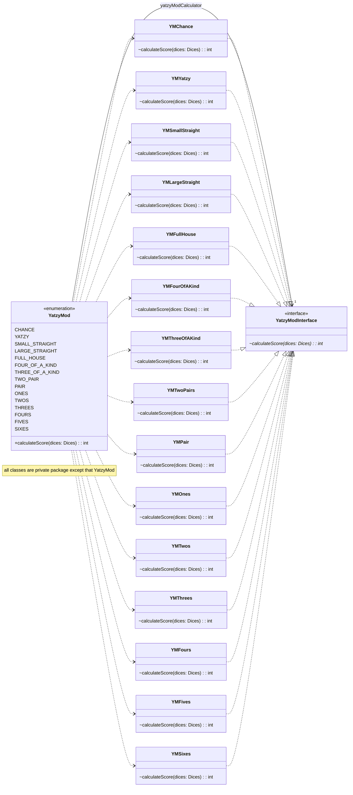

## Main package:

```mermaid
classDiagram
    class Yatzy{
        +chance(dices: Dices)$: int
        +Yatzy(dices: Dices)$: int
        +smallStraight(dices: Dices)$: int
        +largeStraight(dices: Dices)$: int
        +fullHouse(dices: Dices)$: int
        +fourOfAKind(dices: Dices)$: int
        +threeOfAKind(dices: Dices)$: int
        +twoPair(dices: Dices)$: int
        +pair(dices: Dices)$: int
        +ones(dices: Dices)$: int
        +twos(dices: Dices)$: int
        +threes(dices: Dices)$: int
        +fours(dices: Dices)$: int
        +fives(dices: Dices)$: int
        +sixes(dices: Dices)$: int
    }
    Yatzy ..> YatzyMod
    Yatzy ..> Dices

    class YatzyMod{
        <<enumeration>>
        CHANCE
        Yatzy
        SMALL_STRAIGHT
        LARGE_STRAIGHT
        FULL_HOUSE
        FOUR_OF_A_KIND
        THREE_OF_A_KIND
        TWO_PAIR
        PAIR
        ONES
        TWOS
        THREES
        FOURS
        FIVES
        SIXES

        +calculateScore(dices: Dices): int
    }
    YatzyMod ..> Dices
    note for YatzyMod "is in yatzy_mod package"

    class Dices{
        +Dices(dice1:int, dice2:int, dice3:int, dice4:int, dice5:int): Dices
        +getDiceValues(): IntStream
    }


```

## yatzy_mod package:

```mermaid
classDiagram
direction LR
    note "all classes are private package except that YatzyMod"

    class YatzyMod{
        <<enumeration>>
        CHANCE
        YATZY
        SMALL_STRAIGHT
        LARGE_STRAIGHT
        FULL_HOUSE
        FOUR_OF_A_KIND
        THREE_OF_A_KIND
        TWO_PAIR
        PAIR
        ONES
        TWOS
        THREES
        FOURS
        FIVES
        SIXES

        +calculateScore(dices: Dices): int
    }
    YatzyMod --> "1" YatzyModInterface: yatzyModCalculator


    class YatzyModInterface{
        <<interface>>
        ~calculateScore(dices: Dices)*: int
    }

    class YMChance{
        ~calculateScore(dices: Dices): int
    }

    class YMYatzy{
        ~calculateScore(dices: Dices): int
    }

    class YMSmallStraight{
        ~calculateScore(dices: Dices): int
    }

    class YMLargeStraight{
        ~calculateScore(dices: Dices): int
    }

    class YMFullHouse{
        ~calculateScore(dices: Dices): int
    }

    class YMFourOfAKind{
        ~calculateScore(dices: Dices): int
    }

    class YMThreeOfAKind{
        ~calculateScore(dices: Dices): int
    }

    class YMTwoPairs{
        ~calculateScore(dices: Dices): int
    }

    class YMPair{
        ~calculateScore(dices: Dices): int
    }

    class YMOnes{
        ~calculateScore(dices: Dices): int
    }

    class YMTwos{
        ~calculateScore(dices: Dices): int
    }

    class YMThrees{
        ~calculateScore(dices: Dices): int
    }

    class YMFours{
        ~calculateScore(dices: Dices): int
    }

    class YMFives{
        ~calculateScore(dices: Dices): int
    }

    class YMSixes{
        ~calculateScore(dices: Dices): int
    }

    YMChance ..|> YatzyModInterface
    YMYatzy ..|> YatzyModInterface
    YMSmallStraight ..|> YatzyModInterface
    YMLargeStraight ..|> YatzyModInterface
    YMFullHouse ..|> YatzyModInterface
    YMFourOfAKind ..|> YatzyModInterface
    YMThreeOfAKind ..|> YatzyModInterface
    YMTwoPairs ..|> YatzyModInterface
    YMPair ..|> YatzyModInterface
    YMOnes ..|> YatzyModInterface
    YMTwos ..|> YatzyModInterface
    YMThrees ..|> YatzyModInterface
    YMFours ..|> YatzyModInterface
    YMFives ..|> YatzyModInterface
    YMSixes ..|> YatzyModInterface

    YatzyMod ..> YMChance
    YatzyMod ..> YMYatzy
    YatzyMod ..> YMSmallStraight
    YatzyMod ..> YMLargeStraight
    YatzyMod ..> YMFullHouse
    YatzyMod ..> YMFourOfAKind
    YatzyMod ..> YMThreeOfAKind
    YatzyMod ..> YMTwoPairs
    YatzyMod ..> YMPair
    YatzyMod ..> YMOnes
    YatzyMod ..> YMTwos
    YatzyMod ..> YMThrees
    YatzyMod ..> YMFours
    YatzyMod ..> YMFives
    YatzyMod ..> YMSixes
```
