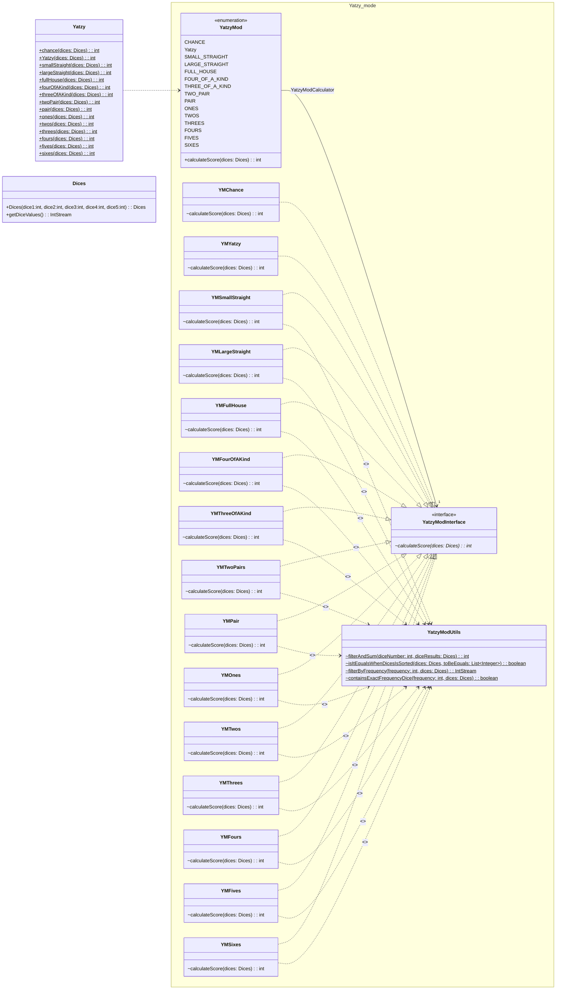

```mermaid

classDiagram
    direction LR
    class Yatzy{
        +chance(dices: Dices)$: int
        +Yatzy(dices: Dices)$: int
        +smallStraight(dices: Dices)$: int
        +largeStraight(dices: Dices)$: int
        +fullHouse(dices: Dices)$: int
        +fourOfAKind(dices: Dices)$: int
        +threeOfAKind(dices: Dices)$: int
        +twoPair(dices: Dices)$: int
        +pair(dices: Dices)$: int
        +ones(dices: Dices)$: int
        +twos(dices: Dices)$: int
        +threes(dices: Dices)$: int
        +fours(dices: Dices)$: int
        +fives(dices: Dices)$: int
        +sixes(dices: Dices)$: int
    }
    Yatzy ..> YatzyMod

    class Dices{
        +Dices(dice1:int, dice2:int, dice3:int, dice4:int, dice5:int): Dices
        +getDiceValues(): IntStream
    }

    namespace Yatzy_mode{

        class YatzyMod{
            <<enumeration>>
            CHANCE
            Yatzy
            SMALL_STRAIGHT
            LARGE_STRAIGHT
            FULL_HOUSE
            FOUR_OF_A_KIND
            THREE_OF_A_KIND
            TWO_PAIR
            PAIR
            ONES
            TWOS
            THREES
            FOURS
            FIVES
            SIXES

            +calculateScore(dices: Dices): int
        }


        class YatzyModInterface{
            <<interface>>

            ~calculateScore(dices: Dices)*: int
        }

        class YMChance{
            ~calculateScore(dices: Dices): int
        }

        class YMYatzy{
            ~calculateScore(dices: Dices): int
        }

        class YMSmallStraight{
            ~calculateScore(dices: Dices): int
        }

        class YMLargeStraight{
            ~calculateScore(dices: Dices): int
        }

        class YMFullHouse{
            ~calculateScore(dices: Dices): int
        }

        class YMFourOfAKind{
            ~calculateScore(dices: Dices): int
        }

        class YMThreeOfAKind{
            ~calculateScore(dices: Dices): int
        }

        class YMTwoPairs{
            ~calculateScore(dices: Dices): int
        }

        class YMPair{
            ~calculateScore(dices: Dices): int
        }

        class YMOnes{
            ~calculateScore(dices: Dices): int
        }

        class YMTwos{
            ~calculateScore(dices: Dices): int
        }

        class YMThrees{
            ~calculateScore(dices: Dices): int
        }

        class YMFours{
            ~calculateScore(dices: Dices): int
        }

        class YMFives{
            ~calculateScore(dices: Dices): int
        }

        class YMSixes{
            ~calculateScore(dices: Dices): int
        }

        class YatzyModUtils{
            ~filterAndSum(diceNumber: int, diceResults: Dices)$: int
            ~isItEqualsWhenDicesIsSorted(dices: Dices, toBeEquals: List~Integer~)$: boolean
            ~filterByFrequency(frequency: int, dices: Dices)$: IntStream
            ~containsExactFrequencyDice(frequency: int, dices: Dices)$: boolean
        }


    }
    YatzyMod --> "1" YatzyModInterface: YatzyModCalculator


    YMChance ..|> YatzyModInterface
    YMYatzy ..|> YatzyModInterface
    YMSmallStraight ..|> YatzyModInterface
    YMLargeStraight ..|> YatzyModInterface
    YMFullHouse ..|> YatzyModInterface
    YMFourOfAKind ..|> YatzyModInterface
    YMThreeOfAKind ..|> YatzyModInterface
    YMTwoPairs ..|> YatzyModInterface
    YMPair ..|> YatzyModInterface
    YMOnes ..|> YatzyModInterface
    YMTwos ..|> YatzyModInterface
    YMThrees ..|> YatzyModInterface
    YMFours ..|> YatzyModInterface
    YMFives ..|> YatzyModInterface
    YMSixes ..|> YatzyModInterface

    YMSixes ..> YatzyModUtils : <<use>>
    YMFives ..> YatzyModUtils : <<use>>
    YMFours ..> YatzyModUtils : <<use>>
    YMThrees ..> YatzyModUtils : <<use>>
    YMTwos ..> YatzyModUtils : <<use>>
    YMOnes ..> YatzyModUtils : <<use>>
    YMFourOfAKind ..> YatzyModUtils : <<use>>
    YMThreeOfAKind ..> YatzyModUtils : <<use>>
    YMPair ..> YatzyModUtils : <<use>>
    YMTwoPairs ..> YatzyModUtils : <<use>>
    YMFullHouse ..> YatzyModUtils : <<use>>
    YMLargeStraight ..> YatzyModUtils : <<use>>
    YMSmallStraight ..> YatzyModUtils : <<use>>


```